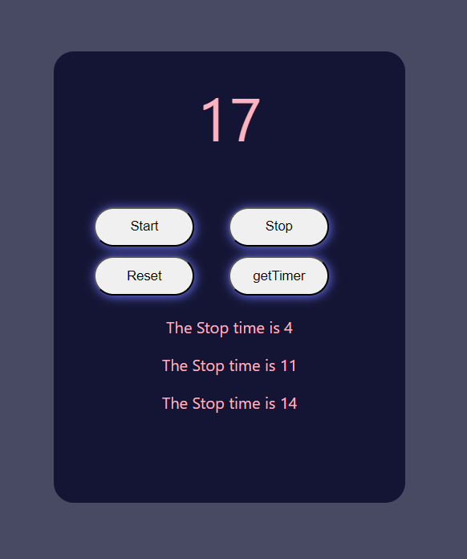

# StopWatch website ⏰
 

## My Learning 📗🔖
> First time used or real used of these
> 
🖊️ setInterval()  
🖊️ clearInterval()  
🖊️ intervalId  

## Projet Features 📋
⚡️ get time info of any second\
⚡️\
⚡️

## Tech stack Used 🛠️
*  HTML
*  CSS3
*  JavaScript

## Contributor 🤝
### Faheem Ahemad
